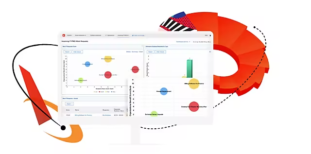

# Configurations d’intégration pour les applications Adobe Experience Cloud - par solution

Cette section aidera quiconque a des besoins professionnels mais n’est pas certain des produits Adobes à utiliser et de la manière de les intégrer.  Nous avons organisé la plupart des configurations d’intégration les plus courantes pour les produits Adobe Enterprise par catégories de solutions.  Gardez à l’esprit qu’il existe de nombreuses façons de configurer les produits Adobe en fonction de votre environnement.  Cette section a pour but de fournir des conseils que vous pouvez déployer en l’état ou modifier pour répondre aux besoins de votre environnement.

<table>
<tr>
    <td>
      
      
<strong><a href="./b2b.md">Marketing B2B</a></strong>

      

        Automatisation marketing et partenariat commercial
      

    </td>
   <td>
      
      
<strong><a href="./commerce.md">[!DNL Commerce]</a></strong>

      

        Commerce numérique B2B et B2C
      

   </td>    
   <td>
      
      
<strong><a href="./content-management.md">Gestion de contenu</a></strong>

      

        Gestion de contenu et de ressources
      

   </td>
</tr>
<tr>
   <td>
      
      
<strong><a href="./content-supply-chain.md">Chaîne d’approvisionnement de contenu</a></strong>

      

        Accélérer la création et la diffusion de contenu
      
 
    </td>
   <td>
      
      
<strong><a href="./customer-journeys.md">Parcours clients</a></strong>

      

        Orchestration et diffusion omnicanal
      
 
    </td>
   <td>
      
      
<strong><a href="./data-insights.md"> Informations et activation des données</a></strong>

      

        [!DNL Analytics] et gestion de l’audience
      

   </td>  
</tr>
<tr>
   <td>
      
      
<strong><a href="./personalization.md">Personnalisation à l’échelle</a></strong>

      

        Comment rendre chaque connexion personnelle
      

   </td>
</table>
